# Real-World Phishing Email Investigation

## Overview

This project documents a SOC-style investigation of a real phishing email that I received in my personal inbox.

The message impersonated Paramount+ and claimed that my subscription had expired. It attempted to convince me to update my payment information through a suspicious link.

I analyzed the email using raw header review, IOC extraction, threat-intelligence enrichment, packet capture analysis, and controlled testing inside an isolated Ubuntu virtual machine.

## Final Verdict

> **Confirmed Phishing — High Confidence**

The visible payment-update link pointed to `affiliatecucumber[.]net` and redirected to `splonir-sys[.]com`, where a fake Paramount+ renewal page was displayed.

Although several investigated indicators showed zero detections in VirusTotal at the time of analysis, the directly observed redirect and brand-impersonation behavior confirmed that the email was malicious.

### Likely Objective

The likely objective was to collect one or more of the following:

- Account credentials
- Personal information
- Payment-card information

The final collection form was not completed or submitted, so the exact information requested after the initial landing page was not confirmed.

---

## Investigation Objectives

The goals of this investigation were to:

1. Determine whether the email was legitimate or malicious.
2. Identify the true sender and sending infrastructure.
3. Review SPF, DKIM, and DMARC authentication results.
4. Extract and investigate suspicious domains, IP addresses, and URLs.
5. Safely observe the behavior of the phishing link.
6. Capture and analyze related DNS and HTTP traffic.
7. Document indicators that could support detection, hunting, and response.
8. Preserve evidence without exposing personal or campaign-specific information.

---

## Tools and Environment

The investigation was performed using:

- Windows 11 host system
- Yahoo Mail raw message and header data
- PowerShell
- VirusTotal
- Passive DNS research
- VMware Workstation
- Ubuntu Linux virtual machine
- `tcpdump`
- Offline PCAP analysis
- SHA-256 hashing

### Sandbox Configuration

The Ubuntu sandbox was configured with:

- 4 GB RAM
- 2 processors
- NAT networking
- Shared folders disabled
- Copy and paste disabled
- Drag and drop disabled
- VMware snapshots created before and after testing
- Network connectivity manually disabled after testing

A clean snapshot was created before opening the suspicious link.

---

## Suspicious Email Summary

The email used Paramount+ branding and claimed that the recipient's subscription had expired. It instructed the recipient to update payment information through a prominent button.

The message appeared to come from Paramount+, but the actual sender and linked infrastructure were unrelated to Paramount.

### Key Email Details

| Field | Observed Value |
|---|---|
| Display name | `Parammount++` |
| Actual sender | `profiles@asphaltatlantis[.]co[.]uk` |
| Sending host | `nice.artistyv[.]org` |
| Originating IP | `173.232.115[.]78` |
| Initial link domain | `affiliatecucumber[.]net` |
| Initial web-server IP | `192.187.102[.]122` |
| Final landing domain | `splonir-sys[.]com` |


---

## Initial Red Flags

Several indicators suggested that the message was suspicious:

- The display name misspelled Paramount.
- The sender address did not belong to Paramount+.
- The email created urgency by claiming the subscription had expired.
- The message requested updated payment information.
- The payment button linked to an unrelated domain.
- The sending infrastructure used multiple unrelated domains.
- The email contained unrelated Adidas tracking links.
- The final landing page copied Paramount+ branding.
- The landing domain had been registered recently.
- Initial reputation checks returned zero detections despite confirmed phishing behavior.

---

## Email Header Analysis

The raw email headers were reviewed to identify the actual sender, sending infrastructure, originating IP address, and authentication results.

### Authentication Results

| Control | Result | Analysis |
|---|---|---|
| SPF | `none` | No SPF authentication result was available for the observed sender. |
| DKIM | `pass` | The email was signed by `asphaltatlantis[.]co[.]uk`, not Paramount+. |
| DMARC | `pass` | DMARC passed for the sender-controlled domain, not a legitimate Paramount domain. |

### Important Finding

Passing DKIM or DMARC does not automatically mean that an email is trustworthy.

In this case, the authentication checks confirmed that the message was authorized by infrastructure associated with `asphaltatlantis[.]co[.]uk`.

They did not confirm that the sender was Paramount+.

A sender can authenticate a domain that they control while using the email content and display name to impersonate another company.

### Header Indicators

- Actual sender: `profiles@asphaltatlantis[.]co[.]uk`
- DKIM domain: `asphaltatlantis[.]co[.]uk`
- Sending host: `nice.artistyv[.]org`
- Originating IP: `173.232.115[.]78`
- Claimed brand: Paramount+
- Authenticated Paramount domain: None

The mismatch between the claimed identity and the authenticated sender domain was a major phishing indicator.

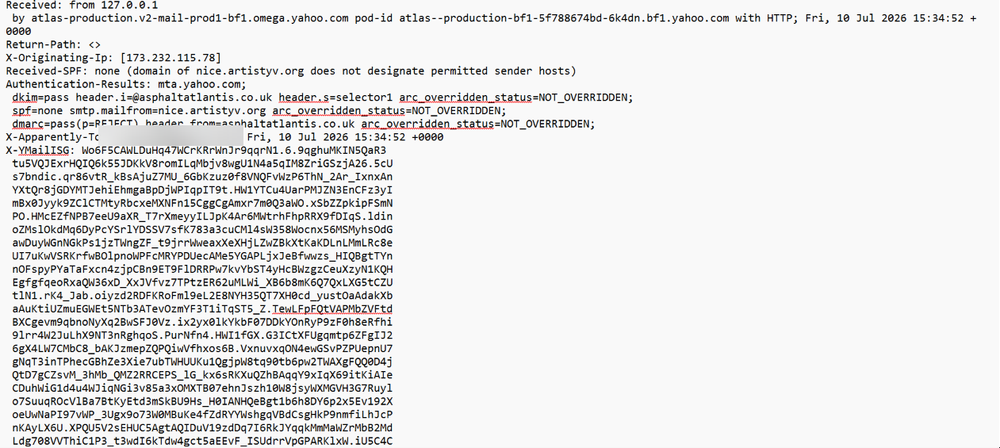

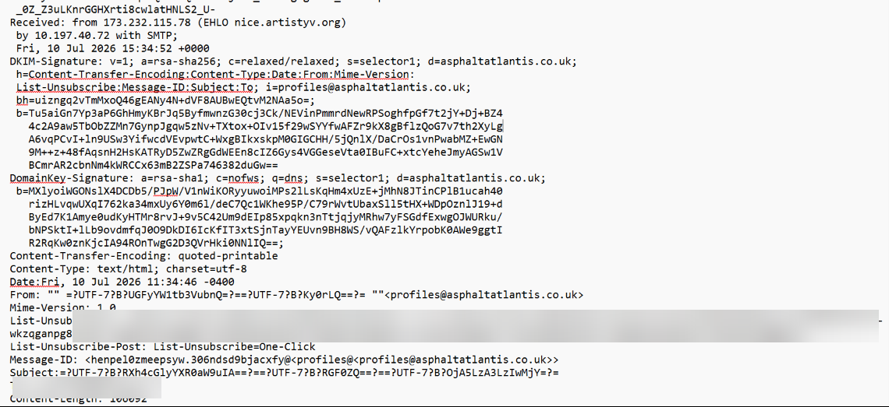

---

## URL Extraction and Redirect Analysis

The visible payment-update button did not lead to a Paramount-owned domain.

### Observed Redirect Chain

```text
Email payment button
        |
        v
affiliatecucumber[.]net
        |
        v
splonir-sys[.]com
        |
        v
Fake Paramount+ renewal page
```

### Initial Link

The payment-update button pointed to:

```text
affiliatecucumber[.]net
```

The full campaign-specific path was preserved privately but is not included in this public repository because it may contain recipient-specific or campaign-specific tracking information.

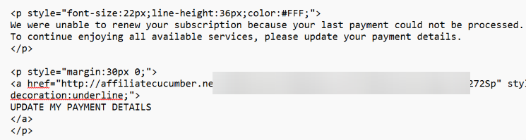

### Root-Domain Test

The root domain displayed a default Apache test page and did not redirect during the captured root-domain HTTP session.

Observed details included:

- Resolved IP: `192.187.102[.]122`
- Protocol: HTTP
- Request: `GET / HTTP/1.1`
- Server: `Apache/2.4.37`
- Operating-system branding: AlmaLinux
- Content type: `text/html; charset=UTF-8`

### Full Campaign-Link Test

Testing the complete campaign-specific link inside the isolated virtual machine redirected the browser to:

```text
splonir-sys[.]com
```

The landing page copied Paramount+ branding and presented a fake subscription-renewal flow.

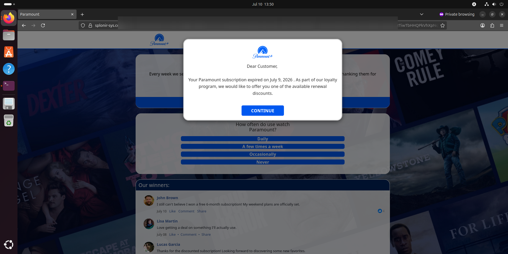

### Evidence Limitation

The root-domain HTTP session was captured in the preserved PCAP.

The campaign-specific redirect to `splonir-sys[.]com` was observed and documented by screenshot, but the second interaction was not captured in the preserved PCAP.

---

## Threat-Intelligence Enrichment

The extracted domains and IP addresses were investigated using VirusTotal and passive DNS information.

### VirusTotal Results

| Indicator | Result at Time of Analysis | Assessment |
|---|---:|---|
| `affiliatecucumber[.]net` | 0/91 | Confirmed phishing link through direct observation |
| `173.232.115[.]78` | 0/91 | Supporting infrastructure indicator |
| `asphaltatlantis[.]co[.]uk` | 0/91 | Suspicious sender-controlled domain |
| `click.link.adidas[.]com` | 0/92 | Unrelated tracking URL; not confirmed malicious |
| `splonir-sys[.]com` | 0/91 | Confirmed phishing landing domain |

### Key Lesson

> Zero VirusTotal detections does not mean that an indicator is safe.

The phishing behavior was confirmed through direct testing, redirect observation, branding impersonation, and infrastructure correlation.

Reputation tools should support an investigation, not replace analyst judgment.

### Passive DNS Observation

The originating IP `173.232.115[.]78` was associated with infrastructure related to `artistyv[.]org`.

This supported the relationship between the originating IP and the sending host identified in the email headers.

The IP address was treated as supporting evidence rather than permanent standalone proof because hosting IP addresses may be shared or reassigned.

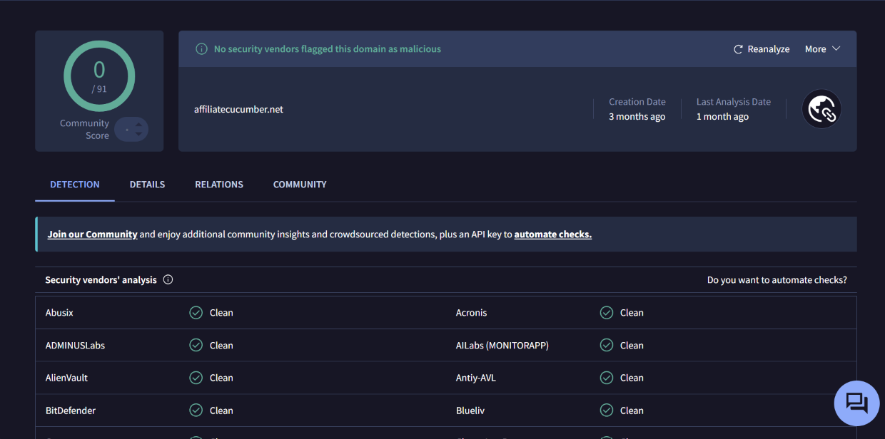

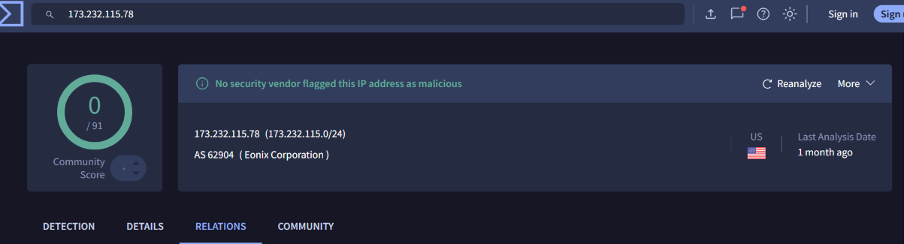

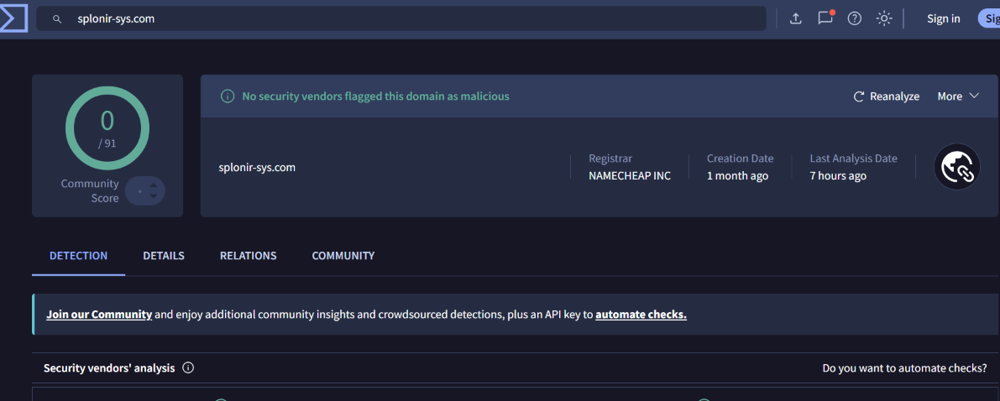

---

## Unrelated Embedded Content

The email HTML also contained tracking links associated with:

```text
click.link.adidas[.]com
```

These links appeared unrelated to the Paramount+ lure and may have been copied from another email template or reused as filler content.

The Adidas domain was not confirmed malicious and should not be blocked based on this investigation.

This demonstrates the importance of separating malicious indicators from unrelated third-party content found inside an email.

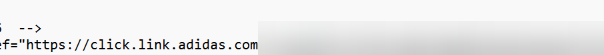

---

## Evidence Preservation

The original email was preserved as an `.eml` file before analysis.

### Email Evidence Hash

```text
SHA-256:
AE8E4FDB57F088892FDC3D8262CB3531BE6BABA957D7D5D94028A7EAD5A95EF6
```

### Packet-Capture Hash

```text
SHA-256:
963B8746467ACDF347EFF47945485CD01BA412E6F49C42AE43C732F0EBEC7020
```

The raw `.eml` and PCAP files are not included in this public repository because they may contain personal information, tracking identifiers, internal addresses, or campaign-specific data.

Only sanitized screenshots, hashes, and findings are published.

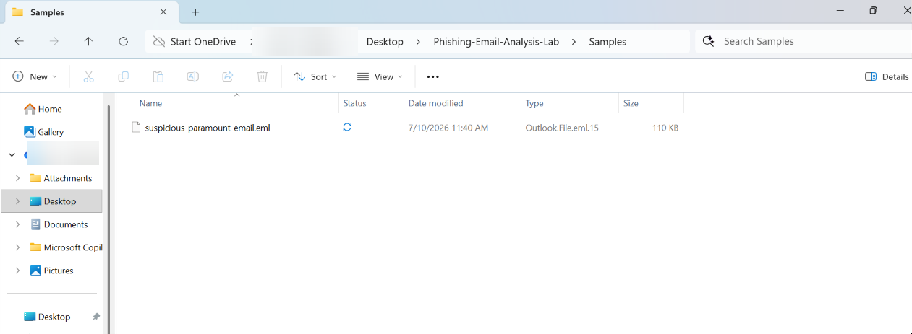

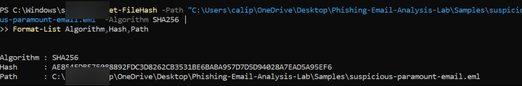

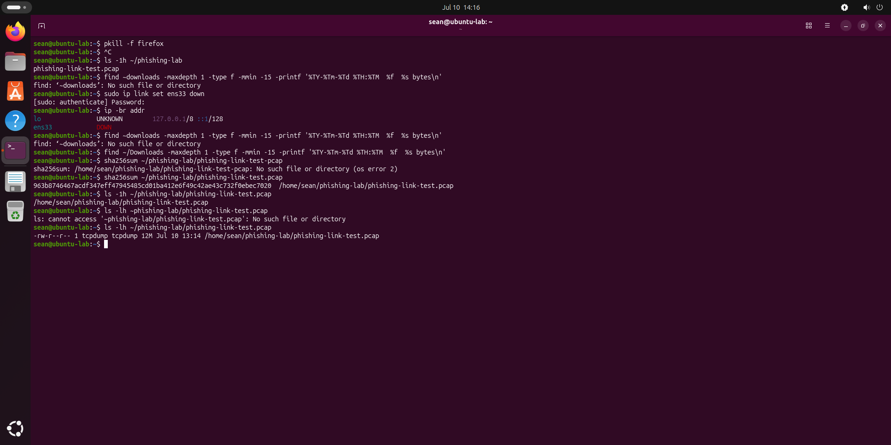

---

## Controlled Sandbox Testing

The suspicious link was tested only inside a disposable Ubuntu virtual machine.

### Safety Controls

- Clean pre-test snapshot created
- VMware guest isolation enabled
- Host-to-guest clipboard disabled
- Drag and drop disabled
- Shared folders disabled
- Network traffic captured with `tcpdump`
- Browser closed after testing
- VM network interface manually disabled
- Post-test snapshot preserved
- VM powered off after evidence collection

No credentials, payment information, or personal information were submitted.

No obvious downloaded file was identified in the Ubuntu Downloads directory during the post-test check.

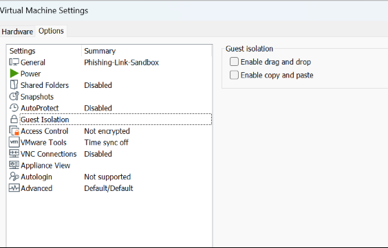

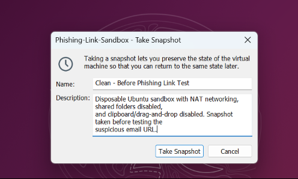

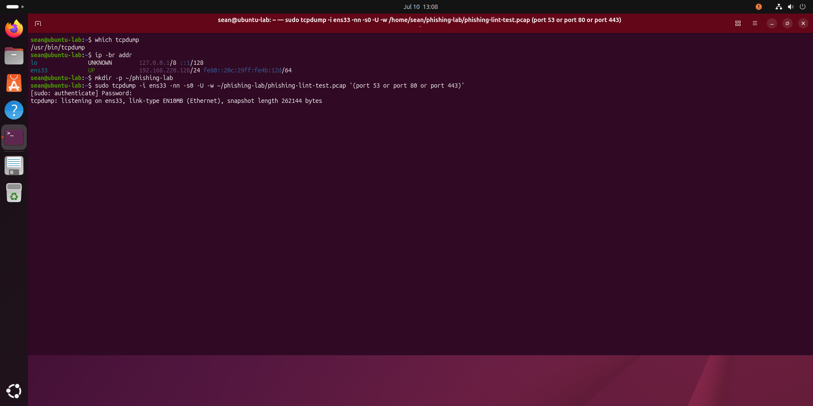

---

## Network Traffic Analysis

Traffic related to DNS, HTTP, and HTTPS was captured using `tcpdump`.

### Capture Filter

```bash
sudo tcpdump -i ens33 -nn -s0 -U \
-w ~/phishing-lab/phishing-link-test.pcap \
'(port 53 or port 80 or port 443)'
```

### DNS Evidence

The PCAP contained a DNS request for:

```text
affiliatecucumber[.]net
```

The DNS response returned:

```text
192.187.102[.]122
```

The response used a short TTL of approximately five seconds.

A short TTL may be useful context, but it is not proof of malicious activity by itself.

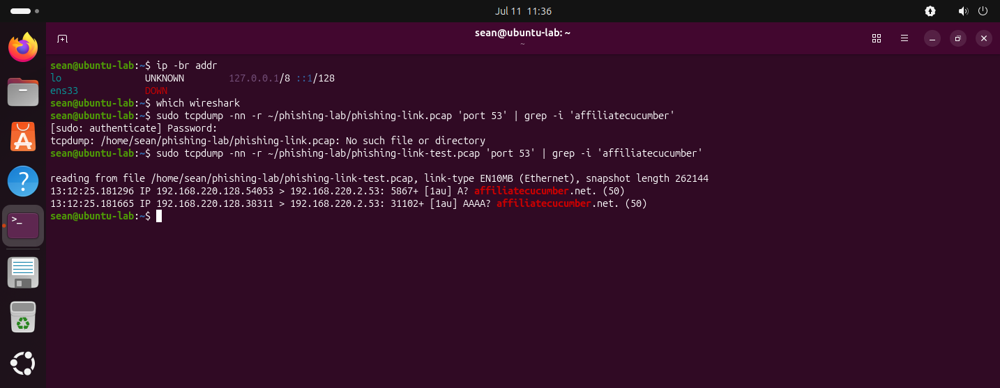

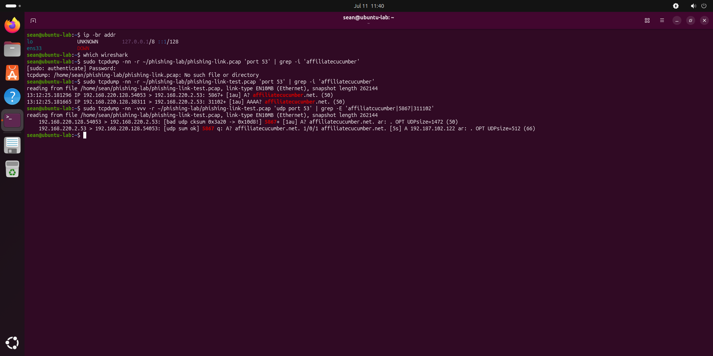

### HTTP Evidence

The PCAP contained an HTTP connection to:

```text
192.187.102[.]122:80
```

The recovered request included:

```http
GET / HTTP/1.1
Host: affiliatecucumber.net
```

The server response identified:

```text
Apache/2.4.37 (AlmaLinux)
```

Additional requested resources included:

```text
/icons/apache_pb.gif
/icons/poweredby.png
/favicon.ico
```

No HTTP `Location` header was observed in the captured root-domain request, confirming that the root page itself did not perform the redirect.

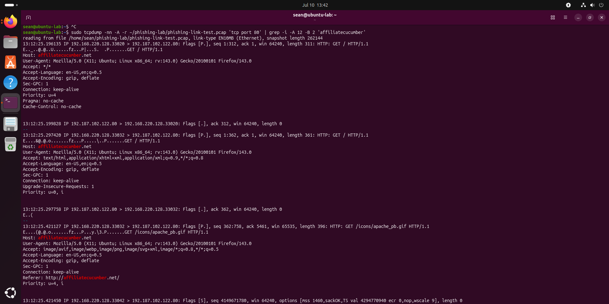

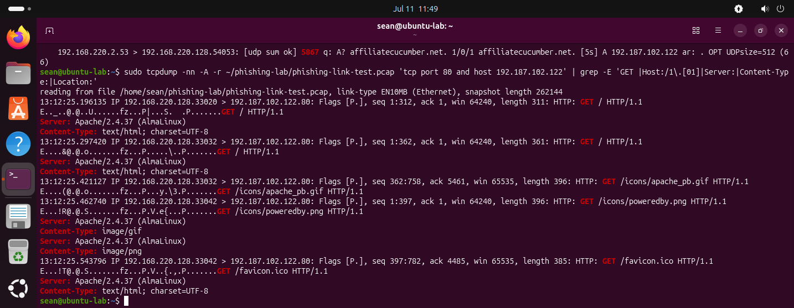

---

## Investigation Timeline

| Stage | Observation |
|---|---|
| Email received | Paramount+ subscription-expiration lure appeared in personal inbox |
| Initial review | Display-name misspelling and unrelated sender identified |
| Header analysis | Originating IP and sender-controlled authentication domain extracted |
| Link inspection | Payment button found pointing to `affiliatecucumber[.]net` |
| Reputation checks | Investigated indicators showed zero VirusTotal detections |
| Sandbox preparation | Disposable Ubuntu VM isolated and clean snapshot created |
| Root-domain test | Default Apache test page observed |
| Full-link test | Redirect to `splonir-sys[.]com` and fake Paramount+ page confirmed |
| Network analysis | DNS response and root HTTP request recovered from PCAP |
| Containment | Browser closed, network disabled, post-test snapshot preserved |
| Final determination | Confirmed phishing with high confidence |

---

## Indicators of Compromise

| Indicator | Type | Assessment |
|---|---|---|
| `profiles@asphaltatlantis[.]co[.]uk` | Sender address | Suspicious |
| `asphaltatlantis[.]co[.]uk` | Sender and DKIM domain | Suspicious |
| `nice.artistyv[.]org` | Sending host | Suspicious |
| `artistyv[.]org` | Infrastructure domain | Supporting evidence |
| `173.232.115[.]78` | Originating IP | Supporting evidence |
| `affiliatecucumber[.]net` | Initial URL domain | Confirmed phishing link |
| `192.187.102[.]122` | Initial web-server IP | Supporting evidence |
| `splonir-sys[.]com` | Final landing domain | Confirmed phishing |
| `click.link.adidas[.]com` | Embedded URL | Unrelated; not confirmed malicious |

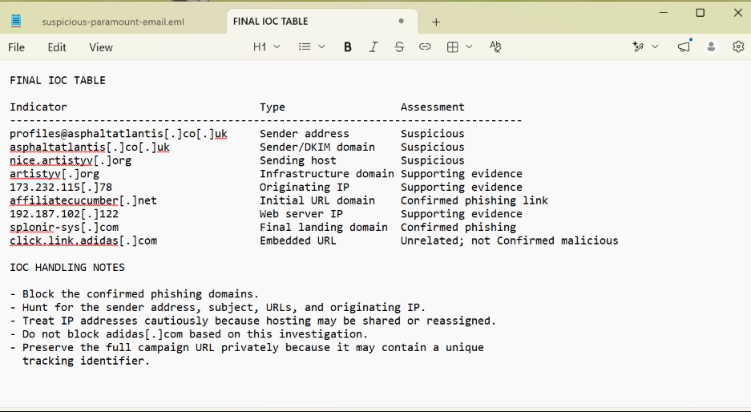

### IOC Handling Recommendations

- Block confirmed phishing domains where appropriate.
- Hunt for the sender address, subject, URLs, and originating IP.
- Search email systems for matching messages.
- Remove matching phishing messages from user inboxes.
- Treat the IP addresses cautiously because they may be shared or reassigned.
- Do not block the legitimate Adidas domain based on this investigation.
- Preserve the complete campaign URL privately for internal investigation.
- Do not publish recipient-specific tracking paths.

---

## MITRE ATT&CK Mapping

### T1566.002 — Phishing: Spearphishing Link

The email attempted to convince the recipient to open a malicious link disguised as a payment-update button.

### T1204.001 — User Execution: Malicious Link

The phishing flow required the recipient to click the embedded link and interact with the fake renewal page.

---

## Detection and Response Recommendations

### Email Security

- Block or quarantine messages containing the confirmed phishing domains.
- Search for messages from `profiles@asphaltatlantis[.]co[.]uk`.
- Search for the misspelled display name `Parammount++`.
- Search for similar subscription-expiration subjects and payment-update language.
- Review messages that authenticate successfully but impersonate unrelated brands.

### DNS and Network Monitoring

Monitor for DNS or HTTP activity involving:

```text
affiliatecucumber[.]net
splonir-sys[.]com
nice.artistyv[.]org
artistyv[.]org
```

The IP addresses may be useful for short-term hunting but should not automatically receive permanent blocks without additional validation.

### User Response

If a user interacted with the phishing page:

1. Determine whether credentials or payment information were entered.
2. Reset exposed account credentials.
3. Revoke active sessions where appropriate.
4. Enable or verify multifactor authentication.
5. Review account activity for unauthorized access.
6. Contact the payment-card provider if card information was submitted.
7. Preserve the email and browser evidence for investigation.

---

## Key Lessons Learned

1. Passing DKIM and DMARC does not prove that an email is legitimate.
2. Display names can be easily manipulated.
3. The visible button text may hide an unrelated destination.
4. Zero detections in reputation tools do not guarantee safety.
5. Direct behavioral evidence can be stronger than reputation scores.
6. Shared IP addresses should be treated carefully during blocking decisions.
7. Controlled sandboxing and snapshots reduce investigation risk.
8. Evidence limitations should be documented honestly.
9. Full tracking URLs should not be published publicly.
10. Unrelated legitimate domains should not be treated as malicious without evidence.

---

## Skills Demonstrated

- Phishing-email triage
- Raw email-header analysis
- SPF, DKIM, and DMARC interpretation
- HTML and URL inspection
- IOC extraction and defanging
- Threat-intelligence enrichment
- Passive DNS correlation
- Linux sandbox preparation
- VMware snapshot management
- Packet capture with `tcpdump`
- DNS traffic analysis
- HTTP request and response analysis
- SHA-256 evidence hashing
- MITRE ATT&CK mapping
- Containment planning
- SOC documentation
- Executive-summary writing

---

## Repository Structure

```text
real-world-phishing-email-investigation/
│
├── README.md
│
└── screenshots/
    ├── 01_Suspicious_Email_Overview.png
    ├── 02_Payment_Update_Lure.png
    ├── 03_Header_Authentication_and_Originating_IP.png
    ├── 04_Sender_and_DKIM_Details.png
    ├── 05_Hidden_Payment_Link.png
    ├── 06_Initial_IOC_Notes.png
    ├── 07_EML_Evidence_File_Saved.png
    ├── 08_EML_SHA256_Hash.png
    ├── 09_VirusTotal_Initial_Domain.png
    ├── 10_VirusTotal_Originating_IP.png
    ├── 11_VirusTotal_Sender_Domain.png
    ├── 12_Unrelated_Adidas_URL_in_HTML.png
    ├── 13_VirusTotal_Adidas_URL.png
    ├── 14_VM_Guest_Isolation_Settings.png
    ├── 15_Clean_Pre_Test_Snapshot.png
    ├── 16_Sandbox_Interface_and_Tcpdump.png
    ├── 17_Packet_Capture_Started.png
    ├── 18_Fake_Paramount_Landing_Page.png
    ├── 19_PCAP_Hash_and_Size.png
    ├── 20_HTTP_Request_Recovered.png
    ├── 21_DNS_Queries_Recovered.png
    ├── 22_DNS_Query_Response_Correlation.png
    ├── 23_Apache_HTTP_Response.png
    ├── 24_VirusTotal_Final_Landing_Domain.png
    ├── 25_Final_IOC_Table.png
    └── 26_Executive_Summary_and_Verdict.png
```

---

## Executive Summary

A suspicious email impersonating Paramount+ was analyzed using raw email headers, URL inspection, VirusTotal, passive DNS, packet-capture analysis, and a controlled Ubuntu sandbox.

The message claimed that the recipient's subscription had expired and requested updated payment information. Header analysis showed that the email originated from infrastructure unrelated to Paramount+.

Although DKIM and DMARC passed, they authenticated the sender-controlled domain `asphaltatlantis[.]co[.]uk`, not Paramount+. This demonstrated that passing email authentication does not prove that the message itself is trustworthy.

The visible payment-update link pointed to `affiliatecucumber[.]net`. Testing the complete campaign-specific URL inside an isolated virtual machine redirected to `splonir-sys[.]com`, which displayed a fake Paramount+ renewal page.

VirusTotal reported zero detections for the investigated phishing domains at the time of analysis. Direct observation, however, confirmed brand impersonation and phishing behavior.

> **Final Verdict: Confirmed Phishing — High Confidence**

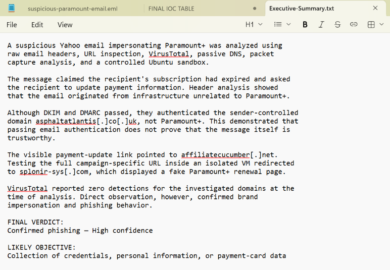

---

## Disclaimer

This project was completed as a personal cybersecurity lab using a real suspicious email received in my own inbox.

The suspicious link was tested only inside an isolated virtual machine. No credentials, payment information, or personal information were submitted.

All published indicators are defanged. Personal information and campaign-specific tracking identifiers have been removed or blurred. The raw email, full URL path, and packet-capture file are intentionally excluded from the public repository.
